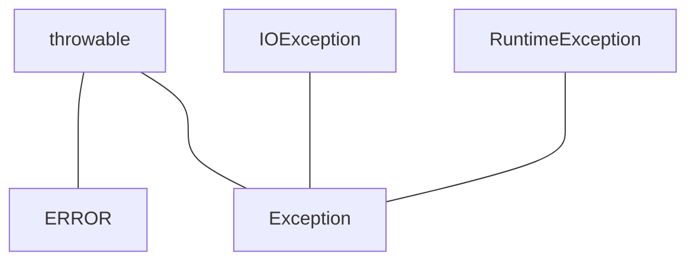

# 7.1处理错误

* 用户输入错误
* 设备错误
* 物理限制
* 代码错误

## 7.1.1 异常分类



### 继承RuntimeException的异常

* 错误的强制类型转换
* 越界的数组访问
* 访问null指针

### 不继承RuntimeException的异常

* 试图约过文件末尾继续读取数据
* 试图打开一个不存在的文件
* 试图根据给定的字符串查找Class对象，而这个字符串表示的类并不存在。

**非检查型异常：派生于Error和RuntimeException**

## 7.1.2 声明检查型异常

```java
// 异常应该放在函数参数之后，函数体之前
public FileInputStream(String name) throws FileNotFoundException
```

## 7.1.3 如何抛出异常

1. 找到一个合适的异常类
2. 创建这个类的一个对象
3. 将对象抛出

>  C++中可以抛出任何类型的值，Java中只能抛出Throwable子类的对象。

## 7.1.4 创建异常类
