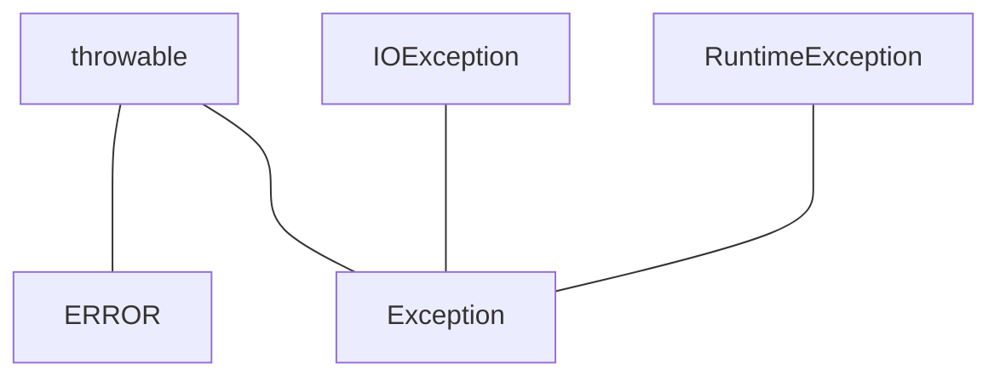

# 7.1处理错误

* 用户输入错误
* 设备错误
* 物理限制
* 代码错误

## 7.1.1 异常分类



### 继承RuntimeException的异常

* 错误的强制类型转换
* 越界的数组访问
* 访问null指针

### 不继承RuntimeException的异常

* 试图约过文件末尾继续读取数据
* 试图打开一个不存在的文件
* 试图根据给定的字符串查找Class对象，而这个字符串表示的类并不存在。

**非检查型异常：派生于Error和RuntimeException**

## 7.1.2 声明检查型异常

```java
// 异常应该放在函数参数之后，函数体之前
public FileInputStream(String name) throws FileNotFoundException
```

## 7.1.3 如何抛出异常

1. 找到一个合适的异常类
2. 创建这个类的一个对象
3. 将对象抛出

> C++中可以抛出任何类型的值，Java中只能抛出Throwable子类的对象。

## 7.1.4 创建异常类

# 7.2 捕获异常

## 7.2.1 捕获异常概述

```java


try{


code


more
code


more
code


}


catch (ExceptionType
e)


{


handler
for this type


}


```

1. 程序将跳过try语句块的其余代码
2. 程序将执行catch字句中的处理器代码

如果当前类不做异常处理，必须声明会抛出某个异常

7.2.2 捕获多个异常

```java


try{


         code
that might throw exceptions 


}catch (
FileNotFoundException e) {


emergency
action for missing files 


}catch ( UnknownHost
Exception e)


{ 


emergency
action for unknown hosts 


}catch (lOException
e)


{ 


emergency
action for all other I/O problems 


}


```

合并异常

```java


 


try


{


cade
that might throw exceptions 


}catch
(FileNoFoundException | UnknownHostException e)


{


/* 捕获多个异常时e为final变量*/


emergency
action for missing files and unknoiun hosts 


}catch (lOException
e)


{


emergency
action for other problems


}


```

7.2.3 再次抛出异常与异常链

```java


try { 


access
the database 


}catch (SQLException
original)


{


var
e = new ServletException("database error"); 


e.initCause(original)
;


throw
e;


}


```

捕获上述异常时，可以使用下面这条语句获取原始异常

```java


Throwable orginal =
caughtException.getCause();)


```

> 如 果在一 个方法 中出现了一个检查型异常，但这个方 法不允许抛出检查型异常，

> 这种情况下包装技术也很有用 Q 我们
> 可以捕 获这个检查型 异常. 并将它 包装成一个运 行时异常

7.2.4 finally子句

不论异常是否出现，finally子句都将执行。

不要把改变控制流的语句放到finally中（return，throw，break，contine）放在finally子句中。

7.2.5 try-with-Resources 语句

当需要自动关闭资源时，可以使用。

```java


//
resources 可以有多个，都会自动关闭


try(var in = new
Scanner(Path.of("in.txt"), StandardCharset.UTF_8);


var
out = new PrintWriter("out.txt", StandardCharset.UTF_8)){


while
(in.hasNext())


System.out.println(in.next());


}


```

try-with-resources 语句自 身也可以有stth 子句，甚至
还可以 有一个 finally 子句 这些子 句会在 关闭资 源之后 执行。

7.2.6 分析栈轨迹元素

```java


package stackTrace;


 


import java.util.*;


 


/**


 * A program that displays a trace feature of a
recursive method call.


 * @version 1.01 2004-05-10


 * @author Cay Horstmann


 */


public class
StackTraceTest


{


   /**


    * Computes the factorial of a number


    * @param n a non-negative integer


    * @return n! = 1 * 2 * . . . * n


    */


   public static int factorial(int n)


   {


      System.out.println("factorial("
+ n + "):");


      Throwable t = new Throwable();


      StackTraceElement[] frames =
t.getStackTrace();


      for (StackTraceElement f : frames)


         System.out.println(f);


      int r;


      if (n <= 1) r = 1;


      else r = n * factorial(n - 1);


      System.out.println("return " +
r);


      return r;


   }


 


   public static void main(String[] args)


   {


      Scanner in = new Scanner(System.in);


      System.out.print("Enter n: ");


      int n = in.nextInt();


      factorial(n);


   }


}


 


```

```terminal


Enter n: 9


factorial(9):


stackTrace.StackTraceTest.factorial(StackTraceTest.java:20)


stackTrace.StackTraceTest.main(StackTraceTest.java:36)


factorial(8):


stackTrace.StackTraceTest.factorial(StackTraceTest.java:20)


stackTrace.StackTraceTest.factorial(StackTraceTest.java:26)


stackTrace.StackTraceTest.main(StackTraceTest.java:36)


factorial(7):


stackTrace.StackTraceTest.factorial(StackTraceTest.java:20)


stackTrace.StackTraceTest.factorial(StackTraceTest.java:26)


stackTrace.StackTraceTest.factorial(StackTraceTest.java:26)


stackTrace.StackTraceTest.main(StackTraceTest.java:36)


factorial(6):


stackTrace.StackTraceTest.factorial(StackTraceTest.java:20)


stackTrace.StackTraceTest.factorial(StackTraceTest.java:26)


stackTrace.StackTraceTest.factorial(StackTraceTest.java:26)


stackTrace.StackTraceTest.factorial(StackTraceTest.java:26)


stackTrace.StackTraceTest.main(StackTraceTest.java:36)


factorial(5):


stackTrace.StackTraceTest.factorial(StackTraceTest.java:20)


stackTrace.StackTraceTest.factorial(StackTraceTest.java:26)


stackTrace.StackTraceTest.factorial(StackTraceTest.java:26)


stackTrace.StackTraceTest.factorial(StackTraceTest.java:26)


stackTrace.StackTraceTest.factorial(StackTraceTest.java:26)


stackTrace.StackTraceTest.main(StackTraceTest.java:36)


factorial(4):


stackTrace.StackTraceTest.factorial(StackTraceTest.java:20)


stackTrace.StackTraceTest.factorial(StackTraceTest.java:26)


stackTrace.StackTraceTest.factorial(StackTraceTest.java:26)


stackTrace.StackTraceTest.factorial(StackTraceTest.java:26)


stackTrace.StackTraceTest.factorial(StackTraceTest.java:26)


stackTrace.StackTraceTest.factorial(StackTraceTest.java:26)


stackTrace.StackTraceTest.main(StackTraceTest.java:36)


factorial(3):


stackTrace.StackTraceTest.factorial(StackTraceTest.java:20)


stackTrace.StackTraceTest.factorial(StackTraceTest.java:26)


stackTrace.StackTraceTest.factorial(StackTraceTest.java:26)


stackTrace.StackTraceTest.factorial(StackTraceTest.java:26)


stackTrace.StackTraceTest.factorial(StackTraceTest.java:26)


stackTrace.StackTraceTest.factorial(StackTraceTest.java:26)


stackTrace.StackTraceTest.factorial(StackTraceTest.java:26)


stackTrace.StackTraceTest.main(StackTraceTest.java:36)


factorial(2):


stackTrace.StackTraceTest.factorial(StackTraceTest.java:20)


stackTrace.StackTraceTest.factorial(StackTraceTest.java:26)


stackTrace.StackTraceTest.factorial(StackTraceTest.java:26)


stackTrace.StackTraceTest.factorial(StackTraceTest.java:26)


stackTrace.StackTraceTest.factorial(StackTraceTest.java:26)


stackTrace.StackTraceTest.factorial(StackTraceTest.java:26)


stackTrace.StackTraceTest.factorial(StackTraceTest.java:26)


stackTrace.StackTraceTest.factorial(StackTraceTest.java:26)


stackTrace.StackTraceTest.main(StackTraceTest.java:36)


factorial(1):


stackTrace.StackTraceTest.factorial(StackTraceTest.java:20)


stackTrace.StackTraceTest.factorial(StackTraceTest.java:26)


stackTrace.StackTraceTest.factorial(StackTraceTest.java:26)


stackTrace.StackTraceTest.factorial(StackTraceTest.java:26)


stackTrace.StackTraceTest.factorial(StackTraceTest.java:26)


stackTrace.StackTraceTest.factorial(StackTraceTest.java:26)


stackTrace.StackTraceTest.factorial(StackTraceTest.java:26)


stackTrace.StackTraceTest.factorial(StackTraceTest.java:26)


stackTrace.StackTraceTest.factorial(StackTraceTest.java:26)


stackTrace.StackTraceTest.main(StackTraceTest.java:36)


return 1


return 2


return 6


return 24


return 120


return 720


return 5040


return 40320


return 362880


```

# 7.3 使用异常的技巧

1. 异常处理不能代替简单的测试
2. 不要过分的细化异常
3. 合理利用异常的层次结构
4. 不要压制异常
5. 在检测错误时，“苛刻”要比放任更好。
6. 不要羞于传递异常。
7. 使用标准方法报告nul指针和越界异常。

   Object包含一下方法：

requireNonNull

checkInde

checkFromToIndex

checkFromIndexSize

8. 不要向最终用户显示栈轨迹

# 7.4 使用断言

断言 ( assertion) 机制允许你在测试期间在代码中捕人一些检查，而在生产代码中自动删 除这些检查口

两种形式：

* assert condition;
* assert condition : expression;

## 7.4.2 启用和禁用断言

默认情况下断言时禁用的。运行时添加以下参数以启用断言：

* -enableassertions
* -ea

可在特定类，或者某个包中启用断言：

```shell
java -ea:MyClass -ea:com.mycompany.mylib MyApp
```

可以在特定包中禁用断言 `-disableassertions`或 `-da`

```shell
java -ea:... -da:MyClass MyApp
```

对于没有类加载器的系统类来说，需要使用 `-enablesystemassertions/-ea` 开关启用系统类中的断言。

## 7.4.3 使用断言完成参数检查

Java提供三种错误处理机制：

* 抛出异常
* 记录日志
* 断言

什么时候使用断言：

* 断言失败是致命的、不可恢复的错误。
* 断言检查旨在开发和测试阶段打开。
* 

# 7.5 日志

## 7.5.1 基本日志

简单的日志记录，可以调用全局日志记录器（global logger）并调用其info方法：

```java
import java.util.logging.Logger;

public class Test {
    public static void main(String[] args){
        Logger.getGlobal().info("File->Open menu item selected");
    }
}
```

抑制所有日志，在main函数开放置“Logger.getGlobal().setLevel(Level.off);”

## 7.5.2 高级日志

可以用getLogger方法创建或获取一个日志记录器：

```java
private static final Logger myLogger = Logger.getLogger("com.mycompany.myapp");
```

日志级别：

* SERVERE
* WARNING
* INFO
* CONFIG
* FINE
* FINER
* FINEST

使用log方法并指定级别：

```java
logger.log(Level.FINE, message);
```

默认的日志配置会记录INFO或更高级别的所有日志。

在找不到准确的调用信息时，可以使用logp方法获得调用类和方法的确切位置：

```java
void logp(Level l, String className, String methodName, String message)
```

## 7.5.3 修改日志管理器配置

默认配置文件：jdk/conf/logging.properties(Java9 之前位于jar/lib/logging.properties)

要使用另一个配置文件，就要将java.util.logging.config.file属性设置为那个文件的位置。

```shell
java -Djava.util.logging.config.file=configFile MainClass
```

## 7.5.4 本地化

一个程序可以包含多个资源包。想要为资源包增加映射，需要对每个本地化环境提供一个文件。

* 英文消息映射：com/mycompany/logmessages_en.properties
* 德文消息映射：com/mycompany/logmessages_de.properties

请求一个日志记录器时，可以指定一个资源包：

```java
Logger logger = logger.getLogger(loggerName, "com.mycompany.logmessages");
# 为日志消息指定资源包的键，而不是具体的日志消息字符串
logger.info("readingFile");
```

资源包文件:

```plaintext
readingFile=Achtung! Datei wird eingelesen
renamingFile=Datei wird umbenannt
# 可以使用占位符
Reading file {0}.
Achtung! Datei {0} wird eingelesen.
```

通过方法向占位符传递具体的值：

```java
legger.log(Level.INFO, "readingFile", fileName)
logger.log(Level.INFO, "renamingFile", new Object[] { oldName, newName});
```

> 这是唯一个可以为消息参数使用可变参数的日志记录方法。

## 7.5.5 处理器

在默认情况下，日志记录器将记录发送到ConsoleHandler，它会将记录输出到System.err流。

日志管理器配置文件将默认的控制台处理器的日志级别设置为 `java.util.logging.ConsoleHander.level=INFO`

要想记录FINE级别的日志，就必须修改配置文件中的默认日志记录器级别和处理器级别。或者可以绕过配置文件，安装你自己的处理器。

```java
Loger logger = Logger.getLogger("com.mycompy.myapp");
logger.setLevel(Level.FINE);
logger.setUseParentHandlers(false);
var handler = new ConsoleHandler();
handler.setLevel(Level.FINE);
logger.addHandler(handler);
```

可以将日志发送到文件中，或者网络特定端口。

* FileHanderl
* SocketHandler

```
// 将文件发送到默认文件处理器
var handler = new FileHander();
logger.addHandler(handler);
```

## 7.5.6 过滤器

过滤器需要实现Filter接口并定义以下方法：

bool isLoggable(LogRecord record)

要将一个过滤器安装到一个日志记录器或处理器中，只需要嗲用setFilter方法。一次只能有一个过滤器。

## 7.5.7 格式化器

ConsoleHandler和FileHandler类可以生成文本和XML格式的日志记录。可以通过扩展Formatter类并覆盖下面这个方法来自定义格式：

String format(LogRecord record)

# 7.6 调试技巧

1. 可以用下面的代码打印或记录任意变量的值

```java
System.out.println("x=" + x);
Logger.getGolbal().info("x=" + x);

```

9. 观察Java虚拟机启动时更多信息，可以使用 `-verbose`标志。
10. -Xlint选项告诉编译器找出常见的代码问题。找出代码问题，但是不违背语法规则的构造。
11. Java虚拟机提供了对Java应用的监控（monitoring）和管理（management）支持，允许在虚拟机中安装代理来跟踪内存消耗、线程使用、类加载等情况。更快请见：www.oracle.com/technetwork/articles/java/jconsole-1564139.html
12. Java任务控制器（Java Mission Control）是一个专业级性能分析和诊断工具，可以从https://adoptopjdk.net/jmc.html得到。教程：https://github.com/thegreystone/jmc-tutorial
